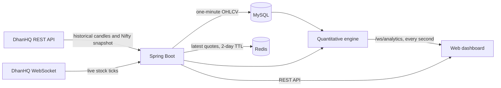

# Trade Analytics — Live Nifty 50 Intelligence

A Spring Boot market-analytics application that ingests Nifty 50 data from DhanHQ, stores one-minute candles in MySQL, caches the latest quotes in Redis, and streams live constituent-level index attribution to a responsive web dashboard.

> This project provides analytical estimates for research and education. It is not investment advice, an order-management system, or a guarantee of future returns.

## Features

- All 50 Nifty constituents, security IDs, sectors, ranks, and portfolio weights seeded through Flyway
- Historical one-minute OHLCV backfill from the DhanHQ API
- Live DhanHQ WebSocket ingestion during NSE market hours
- Idempotent MySQL candle persistence with one row per constituent and minute
- Redis cache for the latest quote of every constituent
- Free-float-weight-based stock and sector impact attribution
- Synthetic Nifty reconstruction and official-index tracking difference
- Market breadth, gross impact, top-five concentration, and risk metrics
- Transparent 15-minute statistical nowcast with confidence and prediction range
- Browser updates every second over a Spring WebSocket
- Desktop and mobile dashboard with index, forecast, breadth, sectors, and all 50 stocks
- Windows one-click startup through `run.bat`

## Architecture



## Technology

- Java 17+
- Spring Boot 4.1
- Spring MVC, WebSocket, Data JPA, Validation, and Data Redis
- MySQL 8.4
- Redis 7.4
- Flyway database migrations
- Maven Wrapper
- Vanilla HTML, CSS, and JavaScript frontend
- JUnit and H2 for backend tests
- Playwright for dashboard smoke testing

## Prerequisites

Install the following before starting:

- Java 17 or newer
- Docker Desktop with Docker Compose
- Windows PowerShell or Command Prompt for `run.bat`

No system Maven installation is required; the repository includes Maven Wrapper scripts.

## Quick start on Windows

1. Clone the repository and enter it:

   ```powershell
   git clone git@github-second:Dipendra-creator/trade-analytics.git
   Set-Location trade-analytics
   ```

2. Create the local environment file:

   ```powershell
   Copy-Item .env.example .env
   ```

3. Add your Dhan client ID and access token to `.env`:

   ```dotenv
   DHAN_CLIENT_ID=your-client-id
   DHAN_ACCESS_TOKEN=your-access-token
   ```

4. Double-click `run.bat`, or run it from a terminal:

   ```powershell
   .\run.bat
   ```

5. Open [http://localhost:8080](http://localhost:8080).

`run.bat` checks whether the application is already available, starts MySQL and Redis through Docker Compose, and launches Spring Boot. Keep its terminal window open while using the application.

## Manual startup

Use this flow when you want separate infrastructure and application terminals:

```powershell
Copy-Item .env.example .env
docker compose up -d mysql redis
.\mvnw.cmd spring-boot:run
```

Check container health with:

```powershell
docker compose ps
```

Stop the infrastructure without deleting its data:

```powershell
docker compose stop
```

## Configuration

Spring imports the local `.env` file automatically. The file is ignored by Git and must never be committed.

| Variable | Default | Purpose |
|---|---:|---|
| `DHAN_CLIENT_ID` | empty | Dhan client ID used for authenticated requests |
| `DHAN_ACCESS_TOKEN` | empty | Dhan access token used by REST and live feeds |
| `DHAN_BACKFILL_ENABLED` | `true` | Enables historical candle ingestion |
| `DHAN_LIVE_FEED_ENABLED` | `true` | Enables the live stock WebSocket |
| `DHAN_BACKFILL_FROM` | `2026-07-01T09:15:00` | First timestamp requested during backfill |
| `DHAN_BACKFILL_TO` | current time | Optional final backfill timestamp |
| `MYSQL_DATABASE` | `demo` | MySQL database name |
| `MYSQL_USER` | `demo_user` | Application database user |
| `MYSQL_PASSWORD` | `demo_password` | Application database password |
| `MYSQL_ROOT_PASSWORD` | `root_password` | Local Docker MySQL root password |
| `REDIS_HOST` | `localhost` | Redis host used by Spring |
| `REDIS_PORT` | `6379` | Redis port used by Spring |
| `ANALYTICS_REFRESH_MS` | `1000` | Continuous quant calculation interval in milliseconds |
| `OPENAI_MODEL` | `gpt-4o-mini` | Responses API model used for live market context |
| `OPENAI_ANALYSIS_REFRESH_MS` | `60000` | OpenAI narrative refresh interval in milliseconds |
| `SETTINGS_ADMIN_USERNAME` | `admin` | HTTP Basic username for the secure settings page |
| `SETTINGS_ADMIN_PASSWORD` | empty | HTTP Basic password for the secure settings page |
| `SETTINGS_ENCRYPTION_KEY` | empty | Base64 AES-256 key used to encrypt stored credentials |

The application can start without Dhan credentials, but historical and live ingestion will be skipped. The OpenAI API key is managed from `/settings.html`, encrypted in MySQL, and used only by the server. Without an OpenAI key, `/ai-analysis.html` remains live in quant-only mode. Never place credentials directly in Java files or `application.properties`.

## Live analysis pages

- `/` provides the live index-impact overview.
- `/analysis.html` provides constituent, breadth, sector, and forecast diagnostics.
- `/ai-analysis.html` ranks live trade candidates with deterministic entry, stop, target, confidence, and optional OpenAI market context.
- `/settings.html` securely manages the Dhan access token and OpenAI API key.

The quant engine calculates continuously inside the application, independent of browser connections. Both analysis pages receive cached snapshots over WebSocket without controlling whether calculation runs.

## Reliability and paper qualification

- `/reliability.html` shows current analytics age, constituent coverage, Dhan feed state, and the paper portfolio audit trail.
- `/api/reliability/summary`, `/api/paper/portfolio`, and `/api/paper/trades` expose the same no-store operational evidence.
- Spring Actuator Prometheus metrics run on the private management port `9091`.
- Paper trades use deterministic entries, stops, targets, slippage, transaction costs, position limits, a daily loss limit, and a 30-minute maximum hold. They never submit broker orders.
- The isolated qualification stack, two-year backtester, k6 load profile, monitoring deployment, and backup drill are documented in [RELIABILITY.md](RELIABILITY.md).

## Database model

Flyway runs automatically at startup and manages these tables:

### `nifty50_constituent`

Stores the 50 active constituents and their index metadata:

- rank and Dhan security ID
- symbol and company name
- sector
- supplied index weight
- exchange segment and instrument type
- active state and audit timestamps

### `stock_candle`

Stores one-minute OHLCV history:

- constituent foreign key
- interval start
- open, high, low, and close
- volume and data source
- audit timestamps

The unique key on `(constituent_id, interval_start)` makes repeated backfills safe. MySQL is the historical source of truth; Redis stores `stock:latest:<security-id>` entries with a two-day TTL for fast latest-quote reads.

Useful coverage query:

```sql
SELECT nc.symbol, COUNT(sc.id) AS candle_count,
       MIN(sc.interval_start) AS first_candle,
       MAX(sc.interval_start) AS last_candle
FROM nifty50_constituent nc
LEFT JOIN stock_candle sc ON sc.constituent_id = nc.id
WHERE nc.active = TRUE
GROUP BY nc.id, nc.symbol
ORDER BY nc.rank_number;
```

## HTTP API

Base URL: `http://localhost:8080/api/nifty50`

| Method and path | Description |
|---|---|
| `GET /api/nifty50` | Returns all active constituents in rank order |
| `GET /api/nifty50/{symbol}/latest` | Returns the latest Redis-cached quote |
| `GET /api/nifty50/{symbol}/candles` | Returns persisted candles for the configured default period |
| `GET /api/nifty50/{symbol}/candles?from={timestamp}&to={timestamp}` | Returns candles inside an ISO local-date-time range |

Examples:

```powershell
Invoke-RestMethod http://localhost:8080/api/nifty50
Invoke-RestMethod http://localhost:8080/api/nifty50/HDFCBANK/latest
Invoke-RestMethod "http://localhost:8080/api/nifty50/HDFCBANK/candles?from=2026-07-01T09:15:00&to=2026-07-27T15:30:00"
```

The latest endpoint returns `404` until a live quote exists. Candle requests return `400` when `from` is not earlier than `to`.

## Live analytics WebSocket

Connect a browser or client to:

```text
ws://localhost:8080/ws/analytics
```

The server sends a complete analytics snapshot immediately after connection and then once per second. A snapshot contains:

- timestamp, market status, and constituent coverage
- official and synthetic index levels
- actual and reconstructed point changes
- 15-minute forecast direction, expected points, range, and confidence
- advances, declines, unchanged count, breadth, and concentration
- sector-level contribution
- all stock-level returns, contribution points, impact share, and signal

Minimal browser client:

```javascript
const socket = new WebSocket("ws://localhost:8080/ws/analytics");

socket.onmessage = ({ data }) => {
  const snapshot = JSON.parse(data);
  console.log(snapshot.index, snapshot.forecast, snapshot.stocks);
};
```

## Quantitative methodology

Nifty 50 is a free-float market-capitalisation-weighted index. This application uses the stored start-of-period constituent weights because it does not hold the exchange divisor, shares outstanding, investible weight factors, or every corporate-action adjustment.

For constituent `i`:

```text
stock return_i           = live price_i / previous close_i - 1
normalized weight_i      = supplied weight_i / sum(supplied weights)
return contribution_i    = normalized weight_i × stock return_i
estimated Nifty points_i = previous Nifty close × return contribution_i
synthetic Nifty level    = previous Nifty close × (1 + Σ return contributions)
```

The dashboard reports the difference between the official Dhan Nifty level and the synthetic level as tracking difference. It also calculates signed stock contribution, impact share, gross impact, top-five impact concentration, breadth, and aggregated sector contribution.

The 15-minute nowcast blends weighted 5-, 15-, and 60-minute momentum, a breadth adjustment, cross-sectional dispersion, and shrinkage. Forecast return is capped at ±1.5%, and confidence is capped at 85%. It is a transparent heuristic—not a trained model or a trading signal. See [QUANT_ENGINE.md](QUANT_ENGINE.md) for the full formula and limitations.

## Testing

Run backend tests:

```powershell
.\mvnw.cmd test
```

For the dashboard smoke test, first start the application. Then install Playwright and its Chromium browser once:

```powershell
python -m pip install -r requirements.txt
python -m playwright install chromium
python scripts/test_dashboard.py
```

The smoke test verifies the live socket, index output, 50/50 coverage, sector data, chart rendering, console errors, and mobile overflow. Generated screenshots are ignored by Git.

## Project structure

```text
src/main/java/.../stock/
├── analytics/     # attribution engine, index snapshot, and browser WebSocket
├── api/           # constituent, quote, and candle REST endpoints
├── config/        # Dhan and stock-data configuration
├── domain/        # JPA entities
├── repository/    # Spring Data repositories
└── service/       # Dhan clients, candle aggregation, persistence, and Redis

src/main/resources/
├── db/migration/  # schema and Nifty 50 seed data
└── static/        # dashboard HTML, CSS, and JavaScript
```

## Troubleshooting

### `run.bat` says Docker services failed

Start Docker Desktop, wait until the engine is ready, and run `docker compose ps`. Ports `3306` and `6379` must be available.

### Port 8080 is already in use

Find the owning process in PowerShell:

```powershell
Get-NetTCPConnection -LocalPort 8080 -State Listen |
  Select-Object LocalAddress, LocalPort, OwningProcess
```

Stop only the confirmed application process, or start Spring with another port:

```powershell
.\mvnw.cmd spring-boot:run "-Dspring-boot.run.arguments=--server.port=8081"
```

### Latest quotes return `404`

Confirm valid Dhan credentials, `DHAN_LIVE_FEED_ENABLED=true`, an active market session, and Redis availability. Live market hours are Monday–Friday, 09:15–15:30 Asia/Kolkata, excluding exchange holidays.

### Historical data is incomplete

Check the Dhan API response and application logs, confirm that backfill is enabled, and adjust `DHAN_BACKFILL_FROM`. The unique candle key allows a safe restart without duplicating existing intervals.

## Security

- Never commit `.env`, access tokens, API secrets, database dumps, or runtime logs.
- Rotate a token immediately if it is exposed in chat, terminal output, screenshots, or Git history.
- Replace the Docker development passwords before any shared or production deployment.
- Restrict WebSocket origins and add authentication before exposing this service publicly.
- Use a secrets manager and TLS for a production deployment.

## Further documentation

- [Quantitative engine](QUANT_ENGINE.md)
- [Market-data ingestion](STOCK_DATA.md)
- [Nifty 50 methodology](https://www.niftyindices.com/Methodology/Nifty_Broad_Market_Indices_Methodology.pdf)
- [DhanHQ API documentation](https://dhanhq.co/docs/v2/)
